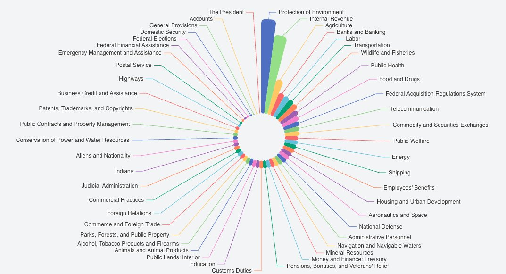

# Electronic Code of Federal Regulations (eCFR) on GitHub
## Up-to-Date eCFR with Complete History in Markdown Format

This project aims to make the **Electronic Code of Federal Regulations (eCFR)** more accessible, transparent, and easier to analyze. By hosting the eCFR on GitHub, changes can be tracked in a structured manner, allowing greater scrutiny, research, and collaboration.

## Purpose

The primary goals of this repository are:

1. **Public Accessibility**: Provide the **eCFR** in an easily accessible and readable Markdown format.
2. **Change Tracking**: Utilize Git's version control to track changes to the regulatory code, making it clear when and how regulations evolve over time.
3. **Scrutiny and Collaboration**: Facilitate public, legal, and academic scrutiny of federal regulations, enabling meaningful discussions and analysis.
4. **Machine Readability**: Markdown format is easier for Large Language Models (LLMs) and other AI tools to parse, analyze, and learn from, supporting legal research and automation.

## Repository Structure

- Each regulation is organized into folders and files in the following heirarchy, although not all titles follow this particular pattern. 
- The particular pattern of each title can be found at eCFR and by using their structure API endpoints.
- The lowest level document corresponds to a **specific regulatory section** (denoted by a "§" symbol).
    - Title      
	- Subtitle   
	- Chapter    
	- Subchapter 
	- Part       
	- Subpart    
	- Section    

## Features
- **Small**: The .git folder is 370MB.
- **Readable Format**: Markdown ensures a clean and structured presentation of federal regulations.
- **Versioned Changes**: Git enables users to track amendments and modifications over time.
- **Optimized for Research**: The dataset is structured for easier parsing, analysis, and ingestion by AI systems.

## Source Code Used to Create this Repo

The code used to convert the eCFR into Markdown format and organize it in this repository is available in a [separate GitHub repository](https://github.com/AlextheYounga/ecfr-analyzer). This is a Laravel-based project that integrates Rust and Bash scripts for efficiently converting the **entire history** of the eCFR. Additionally, PHP scripts are used to handle sections of the eCFR that are particularly difficult to download.  

For example, **Title 40** is so large that attempting to retrieve its history directly from [ecfr.gov](https://www.ecfr.gov) results in **504 timeout errors** for every past version except the current one. The only viable workaround is to download Title 40 in Parts and then reconstruct the documents programmatically. This repository includes scripts specifically designed to handle this process.

It took filling an entire 256GB flash drive full of various ecfr documents and metadata in order to create this, but the final output was MUCH smaller than I anticipated!

## Contributions

We appreciate your interest in improving this repository! However, I will **not** be accepting pull requests. Instead, we encourage users to open **issues** to identify areas for improvement.

### Issues

1. **Encouraged Topics**:
   - Suggestions for improving the clarity or accuracy of the Markdown documents.
   - Identification of contradictions or ambiguities within the regulatory text.
   - Issues related to missing content or formatting inconsistencies.

2. **Civility**:
   - Discussions should remain civil and constructive.
   - Issues containing disrespectful or inflammatory language will be closed without further consideration.

3. **Substance**:
   - Issues must include a clear description of the problem and a suggested improvement.
   - Issues lacking substantive feedback will be closed.

Thank you for your cooperation in making this repository as accurate and useful as possible.

## Known Issues
There may be some discrepencies in the subtractions of documents at certain points in the history, meaning some documents may remain that were actually removed at an earlier date. This is a fairly easy fix, it just takes time to regenerate the history. 

## Disclaimer

This repository is **not an official source** of the **Electronic Code of Federal Regulations**. While every effort has been made to ensure accuracy, users should refer to **official government sources** or consult legal professionals for authoritative information. This project is intended for **educational and informational purposes only**.

---

Thank you for your interest in this project! Together, we can make federal regulations more accessible and understandable for everyone.
